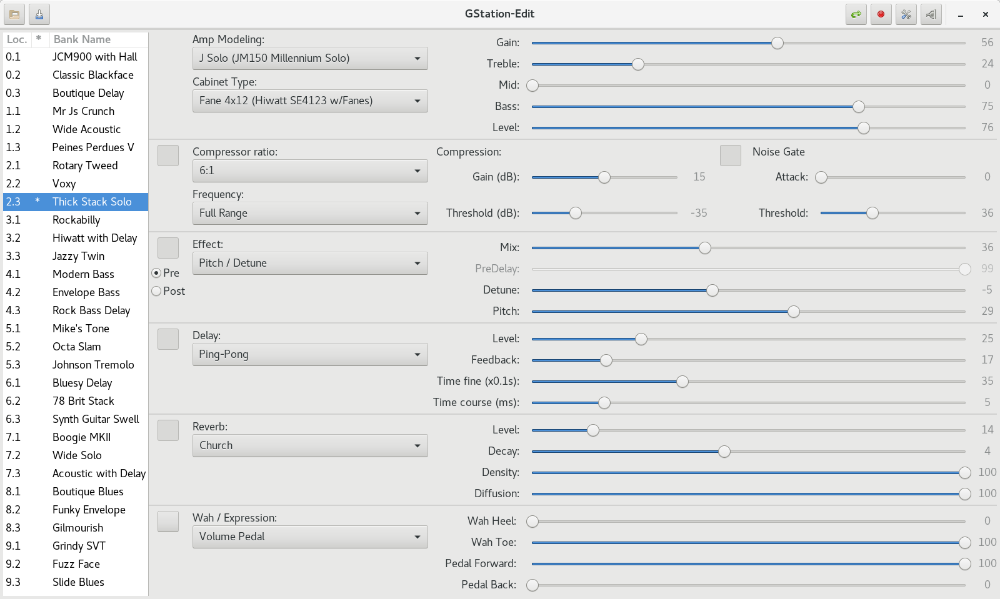

# GStation-Edit

## Description

**GStation-Edit** is a linux replacement for the J-Edit software from Johnson
Amplification. J-Edit is an interface for the J-Station guitar / bass amp
modeling and effect processing system.

The J-Station features a dozen of knobs to access the most common parameters.
To get the full potential of the device, it is more convenient to use a computer
based application. The application also allows saving / restoring parameters
to / from files. The manufaturer ships the device with J-Edit, a Windows based
application for that purpose.

The application communicates with the J-Station over a MIDI connection,
exchanging sysex and CC events. By definition, sysex events are proprietary.
As a consequence, most of the development effort was focused on understanding the
exchanges, designing a communication framework and implementing the messages.

## Screenshots

### With default GNOME theme


<br/>

### With dark GNOME theme


## <a name='features'></a>Features

- Search the J-Station on the available MIDI ports.
- Load user's bank programs.
- Modify parameters/program from the UI and update the J-Station.
- Modify parameters/program from the J-Station and update the UI.
- Rename a program.
- Undo or Store changes from the UI.
- Import and export a program in the same format as J-Edit.
- Import and export a programs bank in the same format as J-Edit.
- Program copy / paste.
- Update utility settings (digital output level, cabinet emulation, ...).
- Track changes with a * in the bank list.

## Not supported

- Only version 2.0 of the firmware is supported.

## <a name='how_to_run'></a>How to run GStation-Edit

### Dependencies

Make sure your system includes the following dependencies:

- python-3
- GTK 3.16 or higher
- gobject-introspection-devel
- The rest of the dependencies will be installed via python.

### Install

#### Virtual Environment Initialization

Execute the following commands in the directory where you wish to add the venv:

```
python -m venv venv
source venv/bin/activate
```

#### Install

From the dowload root directory:

```
pip install build wheel
python -m build
pip install --force-reinstall dist/gstation_edit-2.0.3-py3-none-any.whl
```

#### Execution

##### From the command line

(if you used a venv, enter the venv first).

Use the startup script:

```
gstation-edit
```

##### From the desktop environment

Copy `gstation-edit.desktop` to `~/.local/share/applications/` so that
GStation-Edit appears in your DE.

## Troubleshooting

### Could not connect to J-Station

There are many reasons for not being able to connect to J-Station.
This could range from a simple physical connection to conflicts
with other MIDI devices.

#### Check the connection

1. Make sure the MIDI OUT link from the computer is connected to
the MIDI IN port on the J-Station and vice versa.
2. Make sure the MIDI/J8 switch of the J-Station is switched to
the right when looking at the back of the J-Station. The switch must
be vertically aligned with the top mark next to the MIDI IN label.

#### Check that the MIDI interface is detected

##### The main window shows up

The MIDI ports detected by pyALSA should display In the comboboxes.
If the comboboxes are empty, you probably have an issue with your MIDI interface.
Drop me a message with any relevant information if you think your MIDI interface
is properly installed and recognized by the OS.

If you can see the MIDI ports in the comboboxes but the connection fails when
you try to auto-connect:

- Disconnect any other MIDI device
- Try different settings for the sysex device id.
- Follow the J-Station User's Guide and change the MIDI channel (see Section 5 -
Other Functions, p. 29 of the english version).

I've never been in this situation, so it is possible that GStaton-Edit is not
robust to all cases. Send me a message with the details.
