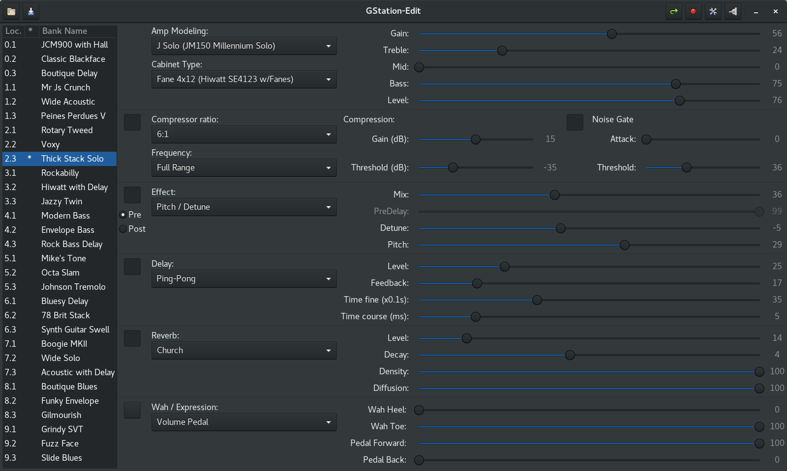

# Description
**GStation-Edit** is a linux replacement for the Windows based J-Edit software
from Johnson Amplification. J-Edit is an interface for the J-Station guitar /
bass amp modeling and effect processing system.
The original J-Edit doesn't work properly with Wine. Communication is ok,
but the UI isn't. See http://appdb.winehq.org/objectManager.php?sClass=version&iId=12067

GStation-Edit is already usable, though it lakes functionalities (see TODOs i
sources and Not supported yet section below). Current architecture is sufficient
to support every missing functionalities easily.

# Screenshots
## With default GNOME theme

<br/>
## With dark GNOME theme



# Features
- (auto-)connect to a valid J-Station unit.
- Load user's bank from the J-Station.
- Modify parameters from the UI and get feedback from the J-Station.
- Modify parameters from the J-Station and update the UI accordingly.
- Change program from the UI.
- Change program from the J-Station.
- Rename a program from the contextual menu. Note that the new name will not be
changed in the J-Station by now since store is not implemented yet.
- Track changes with a * in the bank list. GStation-Edit clears the flag when
initial values are restored (just like the Store button's LED on the J-Station).


# Not supported yet
- Apply changes to a program when changing program from the UI. Need to check
the actual behavior in J-Edit. FTM, just use the Store button on the J-Station.
- The following items in the program list's contextual menu : store and reload
a program, export and import a program, copy / paste.
- Global parameters (digital output level, MIDI merge, ...) These parameters are
loaded during initialization, I only need to build a UI component for them.
- Scale widgets display raw values. Actual units should be displayed instead
(such as dB, ms, etc.)
- Scale widgets will not get to their full range.
- Factory banks are selectable from the J-Station, but will not be reflected
in the UI. I don't remember how this works in J-Edit.
- Only firmware 2.0 is supported (I updated mine a long time ago). However,
very few messages gstation-edit uses are specific to this version.
For the moment, I think ReceiveProgramUpdateRequest is the only one.
The architecture could easily be adapted to previous version.
I don't have a unit to test this (and I don't want to downgrade mine :).


# How to run GStation-Edit
## Dependencies
Make sure your system includes the following dependencies:
- python-2.7 (Python 3 can't be used due to the dependency on PyAlsa which
is stucked to Python 2)
- GTK 3.16 or higher
- gobject-introspection
- pygobject or python-gobject
- pyalsa or python-alsa

## Runing from source
You can launch GStation-Edit from the download root directory:
``` bash
$ ./gstation-edit
```

## Install
You can install gstation-edit in order to integrate with your DE.
After the installation, there should be a "GStation-Edit" entry in
the Audio and Video menu.
### User install
From the dowload root directory:
``` bash
$ ./setup.py install --user
```
### System wide install
From the dowload root directory:
``` bash
# sudo ./setup.py install
```


# Troubleshooting (WIP)
## Could not connect to J-Station
There are many reasons for not being able to connect to J-Station. 
This could range from a simple physical connection to conflicts
with other MIDI devices.

### Check the connection
1. Make sure the MIDI OUT link from the computer is connected to
the MIDI IN port on the J-Station and vice versa.
2. Make sure the MIDI/J8 switch of the J-Station is switched to
the right when looking at the back of the J-Station. The switch must
be vertically aligned with the top mark next to the MIDI IN label.

### Check that the MIDI interface is detected

#### The main window and MIDI select dialog doesn't show up
If nothing happens when you launch GStation-Edit (see **How to run
GStation-Edit** above), you probably forgot to install a dependency. 
This should be explicit on the command line if you run GStation-Edit
from source (see **Runing from source** above).
If you get something not that obvious, don't hesitate to drop me a message
with the output from the command line.

#### The main window shows up
The MIDI ports detected by Py-ALSA should display In the comboboxes. 
If the comboboxes are empty, you probably have an issue with your MIDI interface.
Drop me a message with any relevant information if you think your MIDI interface
is properly installed and recognized by the OS.

If you can see the MIDI ports in the comboboxes but the connection fails when
you try to auto-connect:
- Disconnect any other MIDI device
- Try different combinaisons with the MIDI and Sysex channels.
Since I never met this situation, it is possible that GStaton-Edit is not robust
to all cases. Send me a message with the details.
